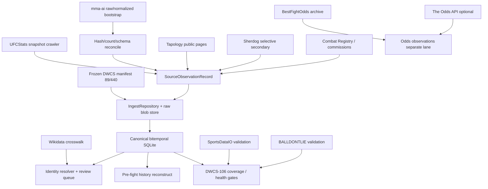

# Public-first MMA historical data design

**Date:** 2026-08-12  
**Ticket:** DWCS-003 (policy amendment)  
**Status:** Approved by user for a personal-project public-first hybrid  
**Machine-readable contract:** `config/sources/source_policy_v1.json`  
**Implementation plan:** `docs/superpowers/plans/2026-08-12-public-first-mma-history.md`  
**Decision canvas (external):** `~/.cursor/projects/Users-aidannugent-mma/canvases/mma-historical-data-strategy.canvas.tsx`

## 1. Problem

Phase 0 licensed-provider audits left `decision.primary = null` with a licensed hard blocker: BALLDONTLIE fails required-feature / PIT gates; SportsDataIO historical seasons are entitlement-blocked on the measured key; Combat Registry lacks a written quote. The previous Phase 1 rule (“official/licensed APIs only”) therefore blocked the historical data foundation even though public UFC/DWCS and regional surfaces exist and the product remains a personal project.

The user approved replacing that Phase 1 licensed-only source policy with a **public-first hybrid**, while **retaining** all identity, leakage, provenance, explicit-missingness, and coverage gates.

## 2. Non-weakening guarantee (explicit)

This policy change does **not** weaken:

| Gate | Retained threshold |
|------|--------------------|
| DWCS universe | **89** cards / **440** bouts |
| Exclusions | Every exclusion categorized (never silent drop) |
| Cross-source reconciliation | **≥98%** where fields are comparable |
| Result agreement | **≥99%** on comparable mapped pairs |
| Identity | **Zero** unresolved evaluated/upcoming identity conflicts |
| Leakage | **Zero** future-row leakage failures |
| Mutable current | **Zero** mutable-current aggregates used as historical features |

It only permits **public-source observations** for a personal project, with explicit **source labels** and **quality tiers**. Licensed scorecard evidence stays historical audit record; `decision.primary` remains `null` until a measured public-source (or later licensed) audit passes.

## 3. Goals and non-goals

### Goals

1. Canonical UFC/DWCS facts and in-cage stats from **direct, reproducible UFCStats snapshots**.
2. Optional bootstrap from **DanMcInerney/mma-ai raw/normalized artifacts** only after independent hash/count/schema reconciliation.
3. Regional/pre-UFC breadth via **Tapology public pages** where accessible; **Sherdog** as selective secondary reconciliation; **Combat Registry** public results (and eventual API) plus **state commissions** as authoritative validation/overrides.
4. Identity via **exact source IDs** and **Wikidata crosswalk** first; fuzzy/transliteration only as candidates in a **reversible review queue**; **no same-name auto-merge**.
5. Odds via **BestFightOdds archive** for public historical reconciliation; optional **The Odds API** structured snapshots from 2020; odds stay separate from the outcome-feature model unless the evaluation contract explicitly enables a challenger.
6. SportsDataIO (current key) and BALLDONTLIE remain **validation/enrichment only** under measured limitations.
7. Rigorous point-in-time (PIT) clocks, quality tiers, future-row invariance, and event/card cutoffs.

### Non-goals (this design / prerequisite PR)

- Implementing production adapters/scrapers in this PR.
- Setting `decision.primary` without measured audits.
- Bypassing logins, paywalls, CAPTCHAs, robots/access controls, or technical restrictions.
- Training on opaque precomputed feature CSVs from third-party dumps.
- Weakening evaluation, identity, or coverage gates to “make coverage look better.”
- Treating licensed hard-blocker clearance as automatic just because public sources are allowed.

## 4. Architecture

### Module boundaries (extend existing)

| Area | Path | Responsibility |
|------|------|----------------|
| Source policy contract | `config/sources/source_policy_v1.json` | Machine-readable policy mode, roles, gates, kill criteria, fallback order |
| Policy loader | `src/mma_model/sources/policy.py` | Load/validate pinned policy; refuse unknown modes |
| Observation contracts | `src/mma_model/sources/contracts.py` | Existing DWCS-101 `SourceObservationRecord` |
| HTTP politeness | `src/mma_model/sources/http/` | Shared rate limit, backoff, UA/contact, block-signal stop |
| UFCStats public adapter | `src/mma_model/sources/ufcstats_public/` | Snapshot fetch, parse, hash, map to contracts (supersedes production-disabled-only posture) |
| Bootstrap reconcile | `src/mma_model/sources/mma_ai_bootstrap/` | Import raw/normalized dumps only after reconciliation |
| Regional adapters | `src/mma_model/sources/tapology_public/`, `sherdog_public/`, `combat_registry/` | Breadth + validation |
| Identity | `src/mma_model/identity/` | Exact-ID + Wikidata; review queue |
| DWCS history | `src/mma_model/dwcs/` | Manifest ingest, classification, sync |
| History reconstruct | `src/mma_model/history/` | Pre-fight records from prior bouts only |
| Quality gates | `src/mma_model/quality/` | Coverage tiers, strict health, leakage audits |
| Odds (later Phase 2 seam) | `src/mma_model/sources/bestfightodds/`, existing odds modules | Separate from outcome features unless contract enables challenger |

**File-size rule:** no planned module file exceeds ~1,000 lines; split parsers, clients, mappers, and CLI wiring.

## 5. Source decision (public-first hybrid)

### 5.1 Canonical UFC / DWCS

1. **Primary:** direct UFCStats public HTML snapshots.
2. **Bootstrap (optional accelerator):** DanMcInerney/mma-ai raw or normalized fight/event artifacts **only after**:
   - Independent content-hash sampling,
   - Row-count agreement within documented tolerances,
   - Schema field mapping to `SourceObservationRecord` attributes,
   - Explicit rejection of opaque precomputed feature CSVs as training inputs.
3. **Validation only:** SportsDataIO accessible seasons; BALLDONTLIE measured slice (preserve scorecard history).

### 5.2 Regional / pre-UFC

| Priority | Source | Role |
|----------|--------|------|
| 1 | Tapology public pages | Primary breadth where accessible without bypass |
| 2 | Sherdog public pages | Selective secondary reconciliation / dispute recovery |
| 3 | Combat Registry public results (+ eventual API) | Authoritative validation |
| 4 | State commissions | Adjudication / reversal overrides |

Conflicts are preserved as `conflict` quality tier; never silent overwrite.

### 5.3 Identity

1. Exact provider external IDs.
2. Wikidata entity crosswalk / aliases.
3. Deterministic name+DOB / name+opponent+event+date candidates.
4. Fuzzy / transliteration → reversible review queue only.
5. Same-name auto-merge is forbidden.
6. Unresolved identities for evaluated or upcoming DWCS bouts **block scoring**.

### 5.4 Odds

- BestFightOdds archive: public historical reconciliation layer.
- The Odds API: optional structured snapshots from mid-2020.
- Odds remain a **separate lane** from outcome-feature training unless `config/evaluation/dwcs_v1.json` explicitly enables an odds-feature challenger (future ticket; not default).

### 5.5 Access ethics (hard)

Never bypass logins, paywalls, CAPTCHAs, robots/access controls, or technical restrictions. Public extraction must use:

- Bounded respectful rates (per-host configured delay),
- Cache + checkpoint resume,
- Deterministic fixture tests (no live network in CI),
- Identifiable User-Agent and contact URL/email,
- Exponential backoff,
- Immediate stop on block signals (HTTP 403/429 persistent, CAPTCHA interstitial, robots disallow, challenge pages).

Kill the source role and fall through the deterministic fallback order rather than “push through.”

## 6. Point-in-time (PIT) design

### 6.1 Four clocks (never conflated)

| Clock | Meaning | May be backfilled as “now”? |
|-------|---------|------------------------------|
| `observed_at` | Acquisition time of **this** capture | **No** — never backdated to pretend historical acquisition |
| `source_updated_at` | Source publication / update timestamp when known | Only when the source provides it |
| `effective_at` | Fact effective time (e.g. bout end, profile as-of) | Set from fact semantics |
| `proxy_published_at` | Documented publication proxy | Only under frozen rule; must be labeled |

### 6.2 Publication proxy rule (frozen)

For **historical immutable** bout / result / stat facts lacking a true publication timestamp:

1. Apply a single frozen rule versioned in config, e.g. `event_completed_at + P1D` (exact delay locked in `config/sources/pit_proxy_v1.json` during DWCS-102).
2. Store `timestamp_quality = publication_proxy` and the rule id/version on the observation attributes.
3. Report proxy rows as **silver** at best (never gold).
4. Prefer Wayback / revision snapshots when available; preserve capture timestamp and content hash; those can upgrade toward **gold** when the snapshot time is known.

**Forbidden:** using current mutable profile aggregates (career totals, current record strings, live rankings) as historical feature inputs. Reconstruct from prior bout facts at the event/card cutoff only.

### 6.3 Quality tiers (strict coverage)

| Tier | Definition |
|------|------------|
| `gold` | Direct timestamp or revision-pinned snapshot |
| `silver` | Stable immutable fact + documented publication proxy + independent agreement |
| `bronze` | Single current retrospective source |
| `missing` | Explicit missing category with reason code |
| `conflict` | Disagreement preserved across sources |

### 6.4 Mandatory leakage controls

- Future-row invariance tests: mutating a later bout must not change earlier reconstructed features.
- Event/card cutoffs: every bout on a card shares one prediction cutoff; no same-card outcome leakage into features.
- Strict health reports fail closed when blockers exist.

## 7. Relationship to licensed audits

`output/research/stats-source-scorecard.json` remains the measured licensed-provider audit:

- `decision.primary = null`
- `decision.hard_blocker = true` for **licensed primary adoption**
- BALLDONTLIE / SportsDataIO metrics preserved

Phase 1 ingest proceeds under `policy_mode = public_first_hybrid_personal_project` in `config/sources/source_policy_v1.json`. Adopting any stack as `decision.primary` still requires a **measured** audit passing coverage, agreement, required features, and PIT fitness.

## 8. Kill criteria and fallback order

Deterministic fallback order:

1. UFCStats direct snapshots  
2. mma-ai raw/normalized bootstrap after reconciliation  
3. Tapology public regional  
4. Sherdog selective secondary  
5. Combat Registry / commission overrides  
6. SportsDataIO validation only  
7. BALLDONTLIE validation only  
8. Explicit `missing` with quality tier  

Per-source kill criteria are encoded in the machine-readable policy. On kill: stop the role, record `source_killed` with reason, continue fallback, never invent coverage.

## 9. Phase 1 ticket mapping

| Ticket | Design responsibility |
|--------|----------------------|
| DWCS-102 | Public UFCStats (+ bootstrap reconcile) core adapter writing `SourceObservationRecord` |
| DWCS-103 | Manifest-first DWCS history ingest, classification, provider ID mapping |
| DWCS-104 | Exact-ID / Wikidata identity resolver + reversible review queue |
| DWCS-105 | Tapology→Sherdog→Combat Registry regional PIT enrichment |
| DWCS-106 | Gold/silver/bronze/missing/conflict coverage + strict health + leakage gates |

Odds archive wiring may land as a Phase 2 seam ticket after DWCS-106; this design freezes the odds **role** now so Phase 1 does not accidentally train on odds features.

## 10. Testing strategy

- TDD-first for every adapter: fixtures of raw HTML/JSON → parser → contract → repository idempotency.
- No live network in CI; optional operator live probes behind explicit flags.
- Contract tests load `source_policy_v1.json` and refuse unknown policy modes.
- Coverage/leakage tests use synthetic bitemporal rows and assert fail-closed exits.
- Schema-drift tests: fixture HTML with renamed columns must raise typed `ParserSchemaDriftError` and refuse silent partial parse as verified.

## 11. Risks

| Risk | Mitigation |
|------|------------|
| Public pages block automation | Kill criteria + fallback; never bypass |
| PIT proxy overconfidence | Proxy cannot be gold; prefer Wayback |
| Identity collisions on common names | Review queue; zero unresolved for upcoming |
| Bootstrap dump divergence | Hash/count/schema gate before import |
| Ops burden of multi-source scrapes | Checkpointing, bounded rates, focused modules |
| Accidental gate weakening | Machine-readable thresholds + DWCS-106 strict exit codes |

## 12. Approval record

- User approved public-first hybrid for personal project (2026-08-12).
- Licensed-only Phase 1 production rights rule superseded for ingest source selection.
- Gates listed in §2 remain mandatory.
- Spec self-review: no TBD/TODO placeholders; `decision.primary` intentionally null until measured audits pass.
